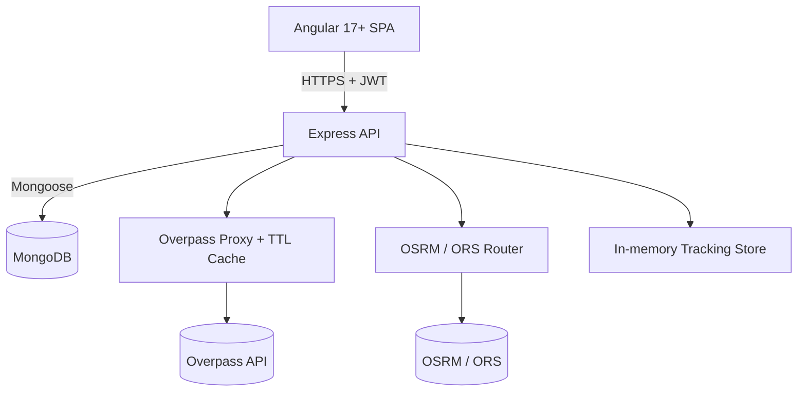

<!-- TourMate — professional README -->

<p align="center">
  <a href="https://github.com/Ahmedbakr78/TourMate/actions"></a>
  <a href="LICENSE"></a>
  <a href="https://www.mongodb.com/"></a>
  <a href="https://angular.io/"></a>
  <a href="https://nodejs.org/"></a>
</p>

# TourMate

> A smart, multi-role tourism platform connecting **Tourists**, **Drivers**, **Guides**, and
> **Administrators** through a unified MEAN-stack ecosystem with real-time location tracking,
> POI discovery, and route intelligence.

TourMate helps travellers discover points of interest, book trusted transport and guided
experiences, and track ongoing trips for safety and coordination — while giving operators a
consolidated dashboard to supervise users and live activity.

---

## Table of Contents

- [Project Overview](#project-overview)
- [Team Roles](#team-roles)
- [Feature Modules](#feature-modules)
- [Technology Stack](#technology-stack)
- [System Architecture](#system-architecture)
- [API Reference](#api-reference)
- [Environment Configuration](#environment-configuration)
- [Local Development](#local-development)
- [Continuous Integration](#continuous-integration)
- [License](#license)

---

## Project Overview

TourMate is organized around four client applications sharing a single stateless REST API:

| App | Audience | Primary Goal |
|-----|----------|--------------|
| Tourist | End travellers | Discover POIs, book trips, track drivers, review |
| Driver | Transport providers | Manage vehicles, share live location, accept trips |
| Guide | Local experts | Publish profile/certificates, manage availability |
| Admin | Platform operators | User governance, statistics, live trip monitoring |

The backend is built with **Node.js + Express + MongoDB** and follows a clean layered
architecture (middleware → services → controllers → routes). The frontend is an **Angular 17+**
standalone-component SPA. External intelligence (POIs, routing) is proxied server-side with
caching. Live tracking uses **polling** (no WebSockets) for simplicity and firewall resilience.

### Folder structure

```
TourMate/
├── client/                 # Angular 17+ standalone SPA
│   ├── src/app/
│   │   ├── admin/          # Admin features (dashboard, user/guide/driver/vehicle mgmt)
│   │   ├── auth/           # Login, register, password flows
│   │   ├── driver-app/     # Driver features
│   │   ├── guide-app/      # Guide features
│   │   ├── trip/           # Trip list/new/detail/calendar/shared
│   │   ├── place/          # POI list & detail
│   │   ├── layout/         # App shell (sidebar + content)
│   │   ├── shared/         # Shared UI (icon, modal, breadcrumb, …)
│   │   ├── core/           # Services, guards, store
│   │   └── app.routes.ts   # Lazy-loaded route definitions
│   ├── Dockerfile
│   └── nginx.conf          # SPA + /api reverse proxy
├── server/                 # Node/Express REST API
│   ├── src/
│   │   ├── modules/        # Feature modules (auth, guide, driver, vehicle, trip, …)
│   │   ├── middlewares/    # auth, rbac, error, upload
│   │   ├── config/         # env, db
│   │   ├── docs/swagger.js # OpenAPI 3 spec
│   │   └── index.js        # App entrypoint (/api-docs mounted here)
│   ├── .env.example
│   └── Dockerfile
└── docker-compose.yml      # mongo + server + client
```

### Default ports

| Service | Port | Notes |
|---------|------|-------|
| API server | `4000` | Base URL `http://localhost:4000/api` |
| Angular dev server | `4200` | `npx ng serve` |
| Mongo (native) | `27017` | |
| Client (Docker) | `80` | served by nginx |
| API docs | `4000` | Swagger UI at `/api-docs` |

---

## Team Roles

| Member | Role | Responsibility |
|--------|------|----------------|
| Ahmed Abo Bakr | Team Manager / Lead Fullstack / Architecture & UML | MEAN architecture, Guide/Driver/Vehicle/Admin APIs, auth architecture, Overpass/OSRM integration, polling tracking, frontend shell + auth UI + admin dashboard, all UML & docs |
| Jamal | Backend — Auth endpoints | Login / register / forgot-password controllers |
| Bavly | Frontend — Tourist app | Tourist flows & booking UI |
| Mai | Backend — Notifications | Notification module & delivery |
| Ramadan | Frontend — Driver/Guide apps | Driver & Guide client apps |

> This branch (`Ahmed`) contains only Ahmed's scoped work. Files owned by teammates live on
> their respective branches and are never overwritten here.

---

## Feature Modules

TourMate is composed of 14 logical modules. Those delivered in this branch are marked
**(Ahmed)**; others are owned by teammates and integrated via their branches.

1. **Auth (Ahmed architecture)** — JWT issue/verify, bcrypt hashing, RBAC middleware. Endpoints owned by Jamal.
2. **User (Ahmed)** — profile model, admin user listing, block/unblock.
3. **Admin (Ahmed)** — statistics dashboard, user management, active trip monitoring.
4. **Guide (Ahmed)** — CRUD, geo + text search, availability, certificate upload/delete.
5. **Driver (Ahmed)** — CRUD, search, availability.
6. **Vehicle (Ahmed)** — CRUD, per-driver vehicle listing, image upload/delete.
7. **Trip** — lifecycle (Draft → Pending → Confirmed → Ongoing → Completed). Booking flow coordinated with Driver/Guide.
8. **Vote (Ahmed schema)** — up/down votes on trips.
9. **Place (Ahmed schema)** — POI storage sourced from Overpass.
10. **Review (Ahmed schema)** — ratings for drivers, guides, places, trips.
11. **Notification (Ahmed schema; delivery by Mai)** — notification documents & models.
12. **Lost Item (Ahmed schema)** — report / mark-found.
13. **Location Tracking (Ahmed)** — polling-based driver position store & poll endpoints (no WebSockets).
14. **External Integrations (Ahmed)** — Overpass POI proxy with TTL cache, OSRM/OpenRouteService routing.

---

## Technology Stack

| Layer | Technology | Purpose |
|-------|-----------|---------|
| Database | MongoDB + Mongoose | Document persistence (10 schemas) |
| API | Node.js + Express | Routing, middleware, business logic |
| Auth | JSON Web Token + bcryptjs | Stateless authN, password hashing |
| Geo Data | Overpass API | POI discovery (OpenStreetMap) |
| Routing | OSRM / OpenRouteService | Route geometry & ETA |
| Client | Angular 17+ (standalone) | SPA, route guards, HTTP client |
| Realtime | Polling (HTTP) | Driver location without WebSockets |
| Infra | GitHub Actions | CI build/lint for server + client |

---

## System Architecture



### Auth flow
Clients authenticate via Jamal's auth endpoints; the issued JWT is attached by the Angular
`authInterceptor` and validated by `authenticate` middleware. `authorize(role)` enforces RBAC.

### Data store (in-memory / MongoDB)
Persistence uses **MongoDB** via **Mongoose**. For development and automated tests the server can
spin up an **in-memory MongoDB** using `mongodb-memory-server`, so no external database is
required to run locally. In production (and via Docker Compose) a real `mongo:6` instance is used.

### Polling-based tracking (no WebSockets)
Drivers `POST /api/tracking/driver/:id/location`; clients `GET /api/tracking/active-trips`
on a fixed interval and re-render map markers. This removes socket infrastructure while meeting
latency needs.

See [`docs/architecture.md`](docs/architecture.md) and [`docs/uml/`](docs/uml) for the full set
of UML diagrams (Use Case, Sequence ×4, Class, Activity, ERD).

---

## API Reference

Base URL: `http://localhost:4000/api`

### Guides
```
GET    /api/guides
POST   /api/guides                 # admin
GET    /api/guides/search?lat=&lng=&radius=
PATCH  /api/guides/:id/availability # guide
POST   /api/guides/:id/certificate  # guide (multipart)
```

### Drivers
```
GET    /api/drivers
POST   /api/drivers                # admin
PATCH  /api/drivers/:id/availability # driver
```

### Vehicles
```
GET    /api/vehicles
POST   /api/vehicles               # admin, driver
GET    /api/vehicles/driver/:driverId
POST   /api/vehicles/:id/image      # multipart
```

### External / Geo
```
GET    /api/external/pois?lat=&lng=&radius=&categories=
GET    /api/external/route?startLng=&startLat=&endLng=&endLat=
```

### Tracking (polling)
```
POST   /api/tracking/driver/:id/location   # driver
GET    /api/tracking/active-trips          # admin, tourist
GET    /api/tracking/driver/:id
```

### Admin
```
GET    /api/admin/users
PATCH  /api/admin/users/:id/block
PATCH  /api/admin/users/:id/unblock
GET    /api/admin/stats
```

---

## Environment Configuration

Copy `server/.env.example` to `server/.env` and adjust:

| Variable | Purpose |
|----------|---------|
| `MONGODB_URI` | MongoDB connection string |
| `JWT_SECRET` / `JWT_EXPIRES_IN` | Access token signing |
| `JWT_REFRESH_SECRET` | Refresh token signing |
| `OVERPASS_URL` / `OVERPASS_TIMEOUT_MS` | POI upstream + 2s cap |
| `OVERPASS_CACHE_TTL_MS` | POI cache lifetime |
| `OSRM_BASE_URL` / `ORS_API_KEY` | Routing provider |
| `UPLOAD_DIR` / `MAX_FILE_SIZE_MB` | File storage |

---

## Local Development

### Backend
```bash
cd server
npm install
cp .env.example .env   # adjust values (see Environment Configuration)
npm start              # node src/index.js  → http://localhost:4000  (health: /health)
# or for hot-reload during development:
npm run dev
```

### Frontend
```bash
cd client
npm install
npx ng serve          # http://localhost:4200
```

The client points at `http://localhost:4000/api` (edit
`client/src/environments/environment.ts`).

---

## Continuous Integration

A GitHub Actions workflow installs, lints, and builds both `server` and `client` on every push
and pull request. See the pipeline summary in [`README`](#continuous-integration) and the
workflow referenced from `.github/workflows/ci.yml`.

---

## Docker

A full stack can be run with Docker Compose (Mongo + API + client served by nginx):

```bash
# from repo root
docker-compose up --build
```

- API available at `http://localhost:4000/api` (docs at `http://localhost:4000/api-docs`).
- Client served by nginx at `http://localhost`.
- The `client/nginx.conf` proxies `/api` (and `/api-docs`) to the `server` container and
  falls back to `index.html` for the SPA.
- Mongo is provided by the `mongo:6` service; `MONGO_URI` is wired to
  `mongodb://mongo:27017/tourmate`.

> Environment variables for the server can be overridden via a `.env` file at the repo root
> (consumed by Compose) — see `server/.env.example` for the available keys.

---

## License

Distributed under the MIT License. See [`LICENSE`](LICENSE).

---

## Team Roles & Task Distribution

This project is developed by a dedicated team of 5 engineers. Detailed module assignments and specific task breakdowns can be found in the [TEAM_TASKS_DISTRIBUTION.md](./TEAM_TASKS_DISTRIBUTION.md) file.

### Team Members:
1. **Ahmed Abo Bakr** - Team Manager, Leader, Fullstack & ALL UML/Architecture Docs
2. **Jamal** - Database, Backend Core & API Docs
3. **Bavly** - Frontend Lead, Tourist App & UI/UX Docs
4. **Mai** - Frontend Providers, Admin Backend & QA Docs
5. **Ramadan** - DevOps, Shared Frontend, QA & Documentation Lead
