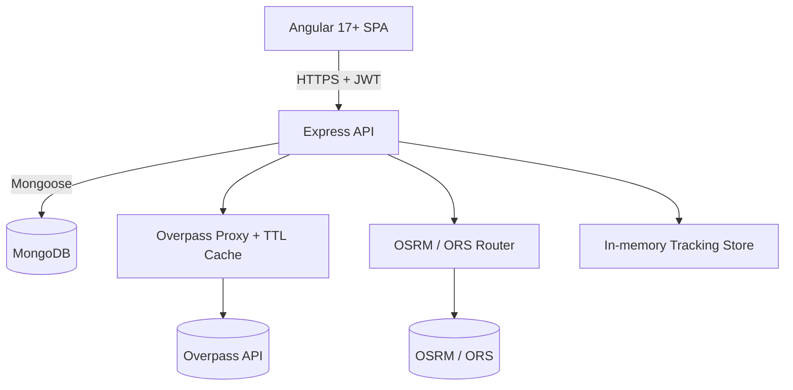

<<<<<<< HEAD
# Jamal — Database Architect, Backend Core

## Role
Database Architect & Backend Core — designs all MongoDB schemas, repositories, middlewares, auth/user/admin modules.

---

## Backend Modules Owned

| Module | Files | Description |
|--------|-------|-------------|
| **Auth** | `backend/modules/auth/auth.controller.ts`, `backend/modules/auth/service/auth.service.ts` | Signup, signin, email confirmation, password reset, token refresh, logout |
| **User** | `backend/modules/user/user.controller.ts`, `backend/modules/user/service/user.service.ts` | User CRUD, profile image, account management |
| **Admin** | `backend/modules/admin/admin.controller.ts`, `backend/modules/admin/service/admin.service.ts` | Dashboard, statistics, user/role/status management, trip admin actions |

---

## Database — All MongoDB Schemas (10+)

| Model | File |
|-------|------|
| User | `backend/db/models/user.model.ts` |
| Driver | `backend/db/models/driver.model.ts` |
| Guide | `backend/db/models/guide.model.ts` |
| Vehicle | `backend/db/models/vehicle.model.ts` |
| Place | `backend/db/models/place.model.ts` |
| Trip | `backend/db/models/trip.model.ts` |
| Vote | `backend/db/models/vote.model.ts` |
| Review | `backend/db/models/review.model.ts` |
| Notification | `backend/db/models/notification.model.ts` |
| LostItem | `backend/db/models/lostIem.model.ts` |
| BlackListedToken | `backend/db/models/black-listed-token.model.ts` |

## Database — All Repositories

| Repository | File |
|------------|------|
| Base | `backend/db/repo/base.repo.ts` |
| User | `backend/db/repo/user.repo.ts` |
| Driver | `backend/db/repo/driver.repo.ts` |
| Guide | `backend/db/repo/guide.repo.ts` |
| Vehicle | `backend/db/repo/vehicle.repo.ts` |
| Place | `backend/db/repo/place.repo.ts` |
| Trip | `backend/db/repo/trip.repo.ts` |
| Vote | `backend/db/repo/vote.repo.ts` |
| Review | `backend/db/repo/review.repo.ts` |
| Notification | `backend/db/repo/notification.repo.ts` |
| LostItem | `backend/db/repo/lostItem.repo.ts` |
| Blacklisted | `backend/db/repo/black-listed.repository.ts` |

## Database Connection
| File | Description |
|------|-------------|
| `backend/db/db.connection.ts` | MongoDB connection setup |

---

## Middlewares

| Middleware | File | Description |
|-----------|------|-------------|
| Authentication | `backend/middlewares/authentication.middleware.ts` | JWT token verification |
| Authorization | `backend/middlewares/authorization.middleware.ts` | Role-based access control |
| Validation | `backend/middlewares/validation.middleware.ts` | Request payload validation |

---

## Utilities

### Encryption
| File | Description |
|------|-------------|
| `backend/utils/encryption/token.utils.ts` | JWT generation & verification |
| `backend/utils/encryption/crypro.utils.ts` | Encryption/decryption helpers |
| `backend/utils/encryption/hash.utils.ts` | Password hashing (bcrypt) |

### Errors
| File | Description |
|------|-------------|
| `backend/utils/errors/exception.utils.ts` | Custom exception classes |
| `backend/utils/errors/http-exception.utils.ts` | HTTP exception handler |

### Response
| File | Description |
|------|-------------|
| `backend/utils/response/respone-helper.utils.ts` | Standardized API response helper |

### Interfaces & Enums
| File | Description |
|------|-------------|
| `backend/common/interfaces/user.interface.ts` | User interface definitions |
| `backend/common/interfaces/respone.interface.ts` | Response interface definitions |
| `backend/common/enums/user.enum.ts` | User role/status enums |

---

## Frontend Features Owned

### Trips
| Component | Path |
|-----------|------|
| Trip Builder | `frontend/features/trips/trip-builder/trip-builder.component.ts`, `.html`, `.scss` |
| Trip Detail | `frontend/features/trips/trip-detail/trip-detail.component.ts`, `.html`, `.scss` |
| My Trips | `frontend/features/trips/my-trips/my-trips.component.ts`, `.html`, `.scss` |
| Shared Trip | `frontend/features/trips/shared-trip/shared-trip.component.ts`, `.html`, `.scss` |
| Payment | `frontend/features/trips/payment/payment.component.ts`, `.html`, `.scss` |
| Trips Module | `frontend/features/trips/trips.module.ts`, `trips-routing.module.ts` |

### Profile
| Component | Path |
|-----------|------|
| Profile | `frontend/features/profile/profile.component.ts`, `.html`, `.scss` |
| Profile Module | `frontend/features/profile/profile.module.ts` |

### Core Services
| Service | Description |
|---------|-------------|
| `frontend/core/services/trip.service.ts` | Trip API calls |
| `frontend/core/services/user.service.ts` | User API calls |

### Models
| Model | File |
|-------|------|
| User | `frontend/core/models/user.model.ts` |
| Trip | `frontend/core/models/trip.model.ts` |
| Response | `frontend/core/models/response.model.ts` |
| Enums | `frontend/core/models/enums.ts` |
| Index | `frontend/core/models/index.ts` |

---

## API Endpoints Built

### Auth
| Method | Endpoint |
|--------|----------|
| POST | `/auth/signup` |
| POST | `/auth/signin` |
| POST | `/auth/confirm_email` |
| POST | `/auth/send_otp_again` |
| POST | `/auth/forgot_password` |
| POST | `/auth/verify_reset_code` |
| PATCH | `/auth/reset_password` |
| POST | `/auth/refresh_token` |
| PATCH | `/auth/change_password` |
| POST | `/auth/logout` |
| GET | `/auth/me` |

### User
| Method | Endpoint |
|--------|----------|
| GET | `/user/current_user_id` |
| GET | `/user/:id` |
| PUT | `/user/update_user` |
| POST | `/user/profile_image` |
| DELETE | `/user/delete_image` |
| DELETE | `/user/delete_account` |

### Admin
| Method | Endpoint |
|--------|----------|
| GET | `/admin/dashboard` |
| GET | `/admin/system-statistics` |
| GET | `/admin/users` |
| GET | `/admin/pending-guides` |
| GET | `/admin/pending-drivers` |
| GET | `/admin/reports` |
| PATCH | `/admin/:id/role` |
| PATCH | `/admin/:id/status` |
| DELETE | `/admin/:id/delete` |
| DELETE | `/admin/trip/:id/delete` |
| PATCH | `/admin/driver/:id/verification-status` |
| PATCH | `/admin/guide/:id/verification-status` |
| PATCH | `/admin/trip/:id/assign-resources` |
| PATCH | `/admin/trip/:id/status` |
| PATCH | `/admin/trip/:id/confirm-payment` |

---

## Other Responsibilities

- **Config:** `package.json`, `tsconfig.json`, `.env` (project-level configuration)
- **Database:** Full schema design, indexing strategy, data layer (all models + repos)
- **Security:** Authentication & authorization middleware, token management, password hashing
- **Error Handling:** Centralized exception classes and response formatting

---

## All Files in Folder

```
Jamal/
├── backend/
│   ├── common/
│   │   ├── enums/
│   │   │   └── user.enum.ts
│   │   └── interfaces/
│   │       ├── respone.interface.ts
│   │       └── user.interface.ts
│   ├── db/
│   │   ├── db.connection.ts
│   │   ├── models/
│   │   │   ├── black-listed-token.model.ts
│   │   │   ├── driver.model.ts
│   │   │   ├── guide.model.ts
│   │   │   ├── lostIem.model.ts
│   │   │   ├── notification.model.ts
│   │   │   ├── place.model.ts
│   │   │   ├── review.model.ts
│   │   │   ├── trip.model.ts
│   │   │   ├── user.model.ts
│   │   │   ├── vehicle.model.ts
│   │   │   └── vote.model.ts
│   │   └── repo/
│   │       ├── base.repo.ts
│   │       ├── black-listed.repository.ts
│   │       ├── driver.repo.ts
│   │       ├── guide.repo.ts
│   │       ├── lostItem.repo.ts
│   │       ├── notification.repo.ts
│   │       ├── place.repo.ts
│   │       ├── review.repo.ts
│   │       ├── trip.repo.ts
│   │       ├── user.repo.ts
│   │       ├── vehicle.repo.ts
│   │       └── vote.repo.ts
│   ├── middlewares/
│   │   ├── authentication.middleware.ts
│   │   ├── authorization.middleware.ts
│   │   └── validation.middleware.ts
│   ├── modules/
│   │   ├── admin/
│   │   │   ├── admin.controller.ts
│   │   │   └── service/
│   │   │       └── admin.service.ts
│   │   ├── auth/
│   │   │   ├── auth.controller.ts
│   │   │   └── service/
│   │   │       └── auth.service.ts
│   │   └── user/
│   │       ├── user.controller.ts
│   │       └── service/
│   │           └── user.service.ts
│   └── utils/
│       ├── encryption/
│       │   ├── crypro.utils.ts
│       │   ├── hash.utils.ts
│       │   └── token.utils.ts
│       ├── errors/
│       │   ├── exception.utils.ts
│       │   └── http-exception.utils.ts
│       └── response/
│           └── respone-helper.utils.ts
├── docs/
│   ├── .env
│   ├── package.json
│   └── tsconfig.json
└── frontend/
    ├── core/
    │   ├── models/
    │   │   ├── enums.ts
    │   │   ├── index.ts
    │   │   ├── response.model.ts
    │   │   ├── trip.model.ts
    │   │   └── user.model.ts
    │   └── services/
    │       ├── trip.service.ts
    │       └── user.service.ts
    └── features/
        ├── profile/
        │   ├── profile.component.html
        │   ├── profile.component.scss
        │   ├── profile.component.ts
        │   └── profile.module.ts
        └── trips/
            ├── my-trips/
            │   ├── my-trips.component.html
            │   ├── my-trips.component.scss
            │   └── my-trips.component.ts
            ├── payment/
            │   ├── payment.component.html
            │   ├── payment.component.scss
            │   └── payment.component.ts
            ├── shared-trip/
            │   ├── shared-trip.component.html
            │   ├── shared-trip.component.scss
            │   └── shared-trip.component.ts
            ├── trip-builder/
            │   ├── trip-builder.component.html
            │   ├── trip-builder.component.scss
            │   └── trip-builder.component.ts
            ├── trip-detail/
            │   ├── trip-detail.component.html
            │   ├── trip-detail.component.scss
            │   └── trip-detail.component.ts
            ├── trips-routing.module.ts
            └── trips.module.ts
```
=======
<!-- TourMate — professional README -->

<p align="center">
  <a href="https://github.com/Ahmedbakr78/TourMate/actions"></a>
  <a href="LICENSE"></a>
  <a href="https://www.mongodb.com/"></a>
  <a href="https://angular.io/"></a>
  <a href="https://nodejs.org/"></a>
</p>

# TourMate

> A smart, multi-role tourism platform connecting **Tourists**, **Drivers**, **Guides**, and
> **Administrators** through a unified MEAN-stack ecosystem with real-time location tracking,
> POI discovery, and route intelligence.

TourMate helps travellers discover points of interest, book trusted transport and guided
experiences, and track ongoing trips for safety and coordination — while giving operators a
consolidated dashboard to supervise users and live activity.

---

## Table of Contents

- [Project Overview](#project-overview)
- [Team Roles](#team-roles)
- [Feature Modules](#feature-modules)
- [Technology Stack](#technology-stack)
- [System Architecture](#system-architecture)
- [API Reference](#api-reference)
- [Environment Configuration](#environment-configuration)
- [Local Development](#local-development)
- [Continuous Integration](#continuous-integration)
- [License](#license)

---

## Project Overview

TourMate is organized around four client applications sharing a single stateless REST API:

| App | Audience | Primary Goal |
|-----|----------|--------------|
| Tourist | End travellers | Discover POIs, book trips, track drivers, review |
| Driver | Transport providers | Manage vehicles, share live location, accept trips |
| Guide | Local experts | Publish profile/certificates, manage availability |
| Admin | Platform operators | User governance, statistics, live trip monitoring |

The backend is built with **Node.js + Express + MongoDB** and follows a clean layered
architecture (middleware → services → controllers → routes). The frontend is an **Angular 17+**
standalone-component SPA. External intelligence (POIs, routing) is proxied server-side with
caching. Live tracking uses **polling** (no WebSockets) for simplicity and firewall resilience.

---

## Team Roles

| Member | Role | Responsibility |
|--------|------|----------------|
| Ahmed Abo Bakr | Team Manager / Lead Fullstack / Architecture & UML | MEAN architecture, Guide/Driver/Vehicle/Admin APIs, auth architecture, Overpass/OSRM integration, polling tracking, frontend shell + auth UI + admin dashboard, all UML & docs |
| Jamal | Backend — Auth endpoints | Login / register / forgot-password controllers |
| Bavly | Frontend — Tourist app | Tourist flows & booking UI |
| Mai | Backend — Notifications | Notification module & delivery |
| Ramadan | Frontend — Driver/Guide apps | Driver & Guide client apps |

> This branch (`Ahmed`) contains only Ahmed's scoped work. Files owned by teammates live on
> their respective branches and are never overwritten here.

---

## Feature Modules

TourMate is composed of 14 logical modules. Those delivered in this branch are marked
**(Ahmed)**; others are owned by teammates and integrated via their branches.

1. **Auth (Ahmed architecture)** — JWT issue/verify, bcrypt hashing, RBAC middleware. Endpoints owned by Jamal.
2. **User (Ahmed)** — profile model, admin user listing, block/unblock.
3. **Admin (Ahmed)** — statistics dashboard, user management, active trip monitoring.
4. **Guide (Ahmed)** — CRUD, geo + text search, availability, certificate upload/delete.
5. **Driver (Ahmed)** — CRUD, search, availability.
6. **Vehicle (Ahmed)** — CRUD, per-driver vehicle listing, image upload/delete.
7. **Trip** — lifecycle (Draft → Pending → Confirmed → Ongoing → Completed). Booking flow coordinated with Driver/Guide.
8. **Vote (Ahmed schema)** — up/down votes on trips.
9. **Place (Ahmed schema)** — POI storage sourced from Overpass.
10. **Review (Ahmed schema)** — ratings for drivers, guides, places, trips.
11. **Notification (Ahmed schema; delivery by Mai)** — notification documents & models.
12. **Lost Item (Ahmed schema)** — report / mark-found.
13. **Location Tracking (Ahmed)** — polling-based driver position store & poll endpoints (no WebSockets).
14. **External Integrations (Ahmed)** — Overpass POI proxy with TTL cache, OSRM/OpenRouteService routing.

---

## Technology Stack

| Layer | Technology | Purpose |
|-------|-----------|---------|
| Database | MongoDB + Mongoose | Document persistence (10 schemas) |
| API | Node.js + Express | Routing, middleware, business logic |
| Auth | JSON Web Token + bcryptjs | Stateless authN, password hashing |
| Geo Data | Overpass API | POI discovery (OpenStreetMap) |
| Routing | OSRM / OpenRouteService | Route geometry & ETA |
| Client | Angular 17+ (standalone) | SPA, route guards, HTTP client |
| Realtime | Polling (HTTP) | Driver location without WebSockets |
| Infra | GitHub Actions | CI build/lint for server + client |

---

## System Architecture


```mermaid
graph TD
  A[Angular 17+ SPA] -->|HTTPS + JWT| B[Express API]
  B -->|Mongoose| C[(MongoDB)]
  B --> D[Overpass Proxy + TTL Cache]
  B --> E[OSRM / ORS Router]
  B --> F[In-memory Tracking Store]
  D --> G[(Overpass API)]
  E --> H[(OSRM / ORS)]
```

### Auth flow
Clients authenticate via Jamal's auth endpoints; the issued JWT is attached by the Angular
`authInterceptor` and validated by `authenticate` middleware. `authorize(role)` enforces RBAC.

### Polling-based tracking (no WebSockets)
Drivers `POST /api/tracking/driver/:id/location`; clients `GET /api/tracking/active-trips`
on a fixed interval and re-render map markers. This removes socket infrastructure while meeting
latency needs.

See [`docs/architecture.md`](docs/architecture.md) and [`docs/uml/`](docs/uml) for the full set
of UML diagrams (Use Case, Sequence ×4, Class, Activity, ERD).

---

## API Reference

Base URL: `http://localhost:4000/api`

### Guides
```
GET    /api/guides
POST   /api/guides                 # admin
GET    /api/guides/search?lat=&lng=&radius=
PATCH  /api/guides/:id/availability # guide
POST   /api/guides/:id/certificate  # guide (multipart)
```

### Drivers
```
GET    /api/drivers
POST   /api/drivers                # admin
PATCH  /api/drivers/:id/availability # driver
```

### Vehicles
```
GET    /api/vehicles
POST   /api/vehicles               # admin, driver
GET    /api/vehicles/driver/:driverId
POST   /api/vehicles/:id/image      # multipart
```

### External / Geo
```
GET    /api/external/pois?lat=&lng=&radius=&categories=
GET    /api/external/route?startLng=&startLat=&endLng=&endLat=
```

### Tracking (polling)
```
POST   /api/tracking/driver/:id/location   # driver
GET    /api/tracking/active-trips          # admin, tourist
GET    /api/tracking/driver/:id
```

### Admin
```
GET    /api/admin/users
PATCH  /api/admin/users/:id/block
PATCH  /api/admin/users/:id/unblock
GET    /api/admin/stats
```

---

## Environment Configuration

Copy `server/.env.example` to `server/.env` and adjust:

| Variable | Purpose |
|----------|---------|
| `MONGODB_URI` | MongoDB connection string |
| `JWT_SECRET` / `JWT_EXPIRES_IN` | Access token signing |
| `JWT_REFRESH_SECRET` | Refresh token signing |
| `OVERPASS_URL` / `OVERPASS_TIMEOUT_MS` | POI upstream + 2s cap |
| `OVERPASS_CACHE_TTL_MS` | POI cache lifetime |
| `OSRM_BASE_URL` / `ORS_API_KEY` | Routing provider |
| `UPLOAD_DIR` / `MAX_FILE_SIZE_MB` | File storage |

---

## Local Development

### Backend
```bash
cd server
npm install
cp .env.example .env
npm run dev          # http://localhost:4000  (health: /health)
```

### Frontend
```bash
cd client
npm install
ng serve             # http://localhost:4200
```

The client points at `http://localhost:4000/api` (edit
`client/src/environments/environment.ts`).

---

## Continuous Integration

A GitHub Actions workflow installs, lints, and builds both `server` and `client` on every push
and pull request. See the pipeline summary in [`README`](#continuous-integration) and the
workflow referenced from `.github/workflows/ci.yml`.

---

## License

Distributed under the MIT License. See [`LICENSE`](LICENSE).

---

## Team Roles & Task Distribution

This project is developed by a dedicated team of 5 engineers. Detailed module assignments and specific task breakdowns can be found in the [TEAM_TASKS_DISTRIBUTION.md](./TEAM_TASKS_DISTRIBUTION.md) file.

### Team Members:
1. **Ahmed Abo Bakr** - Team Manager, Leader, Fullstack & ALL UML/Architecture Docs
2. **Jamal** - Database, Backend Core & API Docs
3. **Bavly** - Frontend Lead, Tourist App & UI/UX Docs
4. **Mai** - Frontend Providers, Admin Backend & QA Docs
5. **Ramadan** - DevOps, Shared Frontend, QA & Documentation Lead
>>>>>>> bbae35c53e0d4fc7007282728f84be53f5cafa8b
