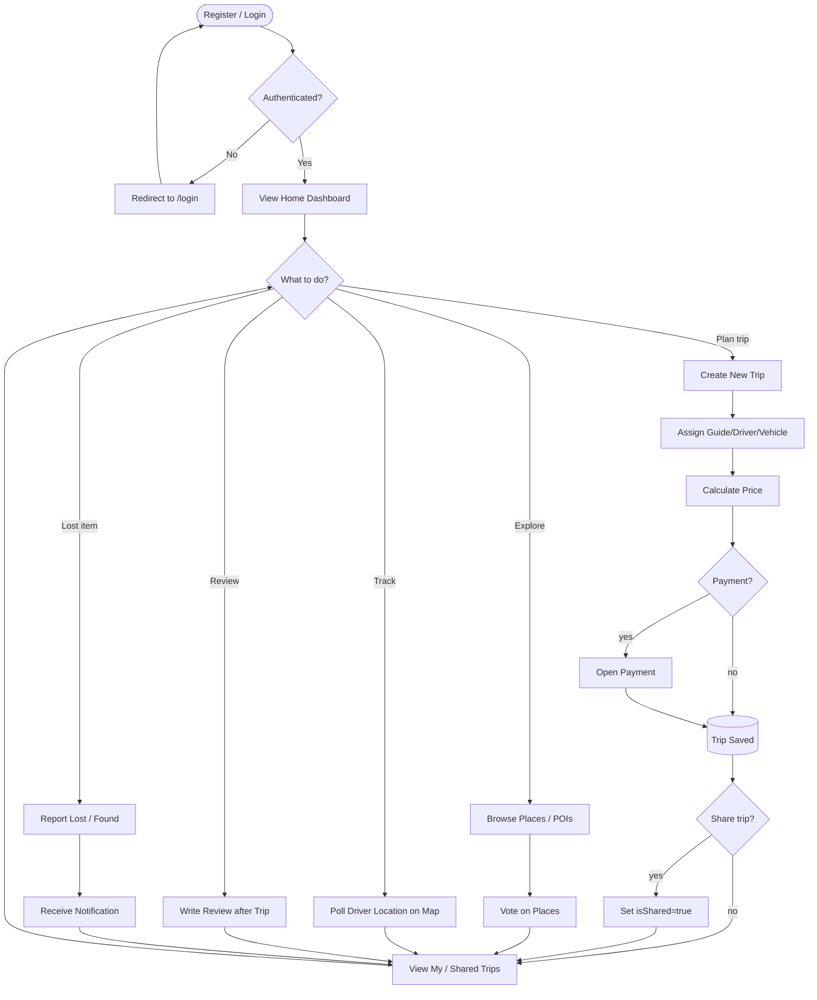

# Activity Diagram — Tourist Journey

```mermaid
flowchart TD
    Start([Register / Login]) --> Auth{Authenticated?}
    Auth -- No --> Login[Redirect to /login]
    Login --> Start
    Auth -- Yes --> Home[View Home Dashboard]
    Home --> Decide{What to do?}

    Decide -- Plan trip --> New[Create New Trip]
    New --> Assign[Assign Guide/Driver/Vehicle]
    Assign --> Calc[Calculate Price]
    Calc --> Pay{Payment?}
    Pay -- yes --> PayUI[Open Payment]
    Pay -- no --> Saved
    PayUI --> Saved[(Trip Saved)]
    Saved --> Share{Share trip?}
    Share -- yes --> ShareOp[Set isShared=true]
    Share -- no --> List
    ShareOp --> List[View My / Shared Trips]

    Decide -- Explore --> Places[Browse Places / POIs]
    Places --> Vote[Vote on Places]
    Vote --> List

    Decide -- Track --> Track[Poll Driver Location on Map]
    Track --> List

    Decide -- Review --> Write[Write Review after Trip]
    Write --> List

    Decide -- Lost item --> Report[Report Lost / Found]
    Report --> Notif[Receive Notification]
    Notif --> List

    List --> Decide
```
