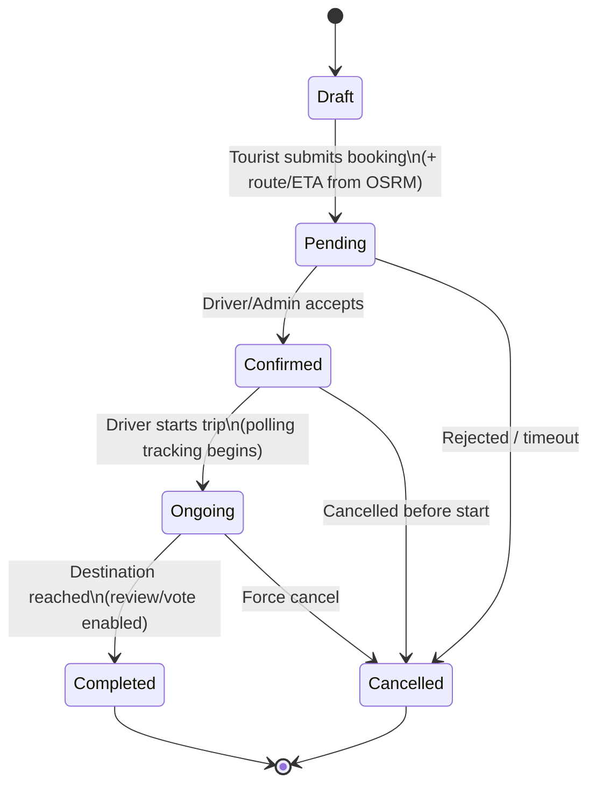

# Activity Diagram — Trip State Machine

States: Draft → Pending → Confirmed → Ongoing → Completed (with Cancelled as a terminal from any non-final state).

```mermaid
stateDiagram-v2
    [*] --> Draft

    Draft --> Pending: Tourist submits booking\n(+ route/ETA from OSRM)
    Pending --> Confirmed: Driver/Admin accepts
    Pending --> Cancelled: Rejected / timeout
    Confirmed --> Ongoing: Driver starts trip\n(polling tracking begins)
    Confirmed --> Cancelled: Cancelled before start
    Ongoing --> Completed: Destination reached\n(review/vote enabled)
    Ongoing --> Cancelled: Force cancel

    Completed --> [*]
    Cancelled --> [*]
```
