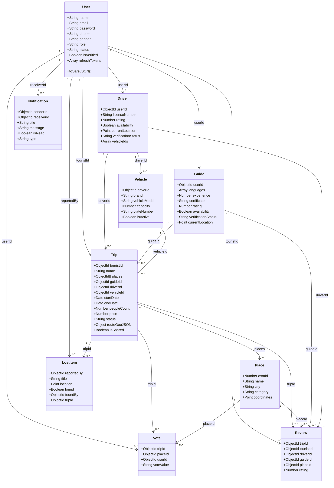

# Class Diagram — TourMate Models

The ten Mongoose models and their key relations (references resolved via `Schema.Types.ObjectId` with `ref`).

```mermaid
classDiagram
    class User {
        +String name
        +String email
        +String password
        +String phone
        +String gender
        +String role
        +String status
        +Boolean isVerified
        +Array refreshTokens
        +toSafeJSON()
    }
    class Driver {
        +ObjectId userId
        +String licenseNumber
        +Number rating
        +Boolean availability
        +Point currentLocation
        +String verificationStatus
        +Array vehicleIds
    }
    class Guide {
        +ObjectId userId
        +Array languages
        +Number experience
        +String certificate
        +Number rating
        +Boolean availability
        +String verificationStatus
        +Point currentLocation
    }
    class Vehicle {
        +ObjectId driverId
        +String brand
        +String vehicleModel
        +Number capacity
        +String plateNumber
        +Boolean isActive
    }
    class Place {
        +Number osmId
        +String name
        +String city
        +String category
        +Point coordinates
    }
    class Trip {
        +ObjectId touristId
        +String name
        +ObjectId[] places
        +ObjectId guideId
        +ObjectId driverId
        +ObjectId vehicleId
        +Date startDate
        +Date endDate
        +Number peopleCount
        +Number price
        +String status
        +Object routeGeoJSON
        +Boolean isShared
    }
    class Vote {
        +ObjectId tripId
        +ObjectId placeId
        +ObjectId userId
        +String voteValue
    }
    class Review {
        +ObjectId tripId
        +ObjectId touristId
        +ObjectId driverId
        +ObjectId guideId
        +ObjectId placeId
        +Number rating
    }
    class LostItem {
        +ObjectId reportedBy
        +String title
        +Point location
        +Boolean found
        +ObjectId foundBy
        +ObjectId tripId
    }
    class Notification {
        +ObjectId senderId
        +ObjectId receiverId
        +String title
        +String message
        +Boolean isRead
        +String type
    }

    User "1" --> "1" Driver : userId
    User "1" --> "1" Guide : userId
    User "1" --> "0..*" Trip : touristId
    User "1" --> "0..*" Vote : userId
    User "1" --> "0..*" Review : touristId
    User "1" --> "0..*" LostItem : reportedBy
    User "1" --> "0..*" Notification : receiverId

    Driver "1" --> "0..*" Vehicle : driverId
    Driver "1" --> "0..*" Trip : driverId
    Guide "1" --> "0..*" Trip : guideId
    Vehicle "1" --> "0..*" Trip : vehicleId

    Trip "1" --> "0..*" Place : places
    Trip "1" --> "0..*" Vote : tripId
    Trip "1" --> "0..*" Review : tripId
    Trip "1" --> "0..*" LostItem : tripId

    Place "1" --> "0..*" Vote : placeId
    Place "1" --> "0..*" Review : placeId
    Guide "1" --> "0..*" Review : guideId
    Driver "1" --> "0..*" Review : driverId
```
