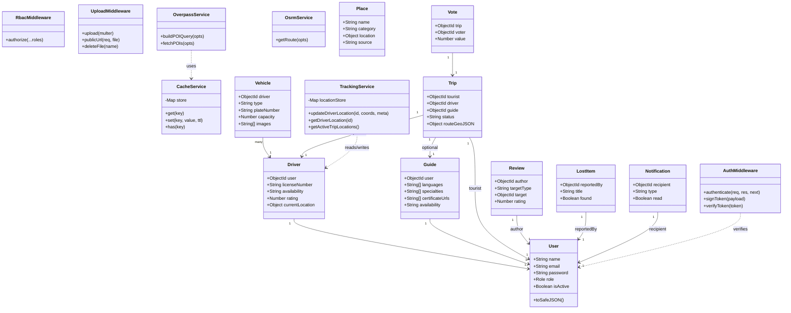

# Class Diagram — TourMate MEAN Backend

```mermaid
classDiagram
    %% Middleware
    class AuthMiddleware {
        +authenticate(req, res, next)
        +signToken(payload)
        +verifyToken(token)
    }
    class RbacMiddleware {
        +authorize(...roles)
    }
    class UploadMiddleware {
        +upload (multer)
        +publicUrl(req, file)
        +deleteFile(name)
    }

    %% Services
    class CacheService {
        -Map store
        +get(key)
        +set(key, value, ttl)
        +has(key)
    }
    class OverpassService {
        +buildPOIQuery(opts)
        +fetchPOIs(opts)
    }
    class OsrmService {
        +getRoute(opts)
    }
    class TrackingService {
        -Map locationStore
        +updateDriverLocation(id, coords, meta)
        +getDriverLocation(id)
        +getActiveTripLocations()
    }

    %% Models
    class User {
        +String name
        +String email
        +String password
        +Role role
        +Boolean isActive
        +toSafeJSON()
    }
    class Driver {
        +ObjectId user
        +String licenseNumber
        +String availability
        +Number rating
        +Object currentLocation
    }
    class Guide {
        +ObjectId user
        +String[] languages
        +String[] specialties
        +String[] certificateUrls
        +String availability
    }
    class Vehicle {
        +ObjectId driver
        +String type
        +String plateNumber
        +Number capacity
        +String[] images
    }
    class Trip {
        +ObjectId tourist
        +ObjectId driver
        +ObjectId guide
        +String status
        +Object routeGeoJSON
    }
    class Place {
        +String name
        +String category
        +Object location
        +String source
    }
    class Vote {
        +ObjectId trip
        +ObjectId voter
        +Number value
    }
    class Review {
        +ObjectId author
        +String targetType
        +ObjectId target
        +Number rating
    }
    class LostItem {
        +ObjectId reportedBy
        +String title
        +Boolean found
    }
    class Notification {
        +ObjectId recipient
        +String type
        +Boolean read
    }

    %% Relationships
    Driver "1" --> "1" User
    Guide "1" --> "1" User
    Vehicle "many" --> "1" Driver
    Trip "1" --> "1" User : tourist
    Trip "1" --> "1" Driver : optional
    Trip "1" --> "1" Guide : optional
    Vote "1" --> "1" Trip
    Review "1" --> "1" User : author
    LostItem "1" --> "1" User : reportedBy
    Notification "1" --> "1" User : recipient

    %% Composition / usage
    OverpassService ..> CacheService : uses
    TrackingService ..> Driver : reads/writes
    AuthMiddleware ..> User : verifies
```
