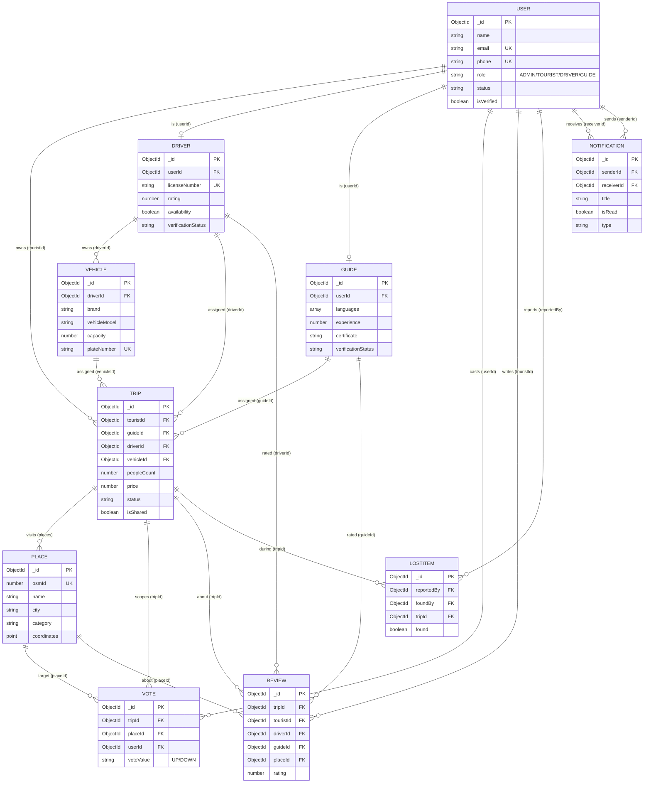

# Entity-Relationship Diagram — TourMate

```mermaid
erDiagram
    USER ||--o{ TRIP : "owns (touristId)"
    USER ||--o| DRIVER : "is (userId)"
    USER ||--o| GUIDE : "is (userId)"
    USER ||--o{ VOTE : "casts (userId)"
    USER ||--o{ REVIEW : "writes (touristId)"
    USER ||--o{ LOSTITEM : "reports (reportedBy)"
    USER ||--o{ NOTIFICATION : "receives (receiverId)"
    USER ||--o{ NOTIFICATION : "sends (senderId)"

    DRIVER ||--o{ VEHICLE : "owns (driverId)"
    DRIVER ||--o{ TRIP : "assigned (driverId)"
    DRIVER ||--o{ REVIEW : "rated (driverId)"

    GUIDE ||--o{ TRIP : "assigned (guideId)"
    GUIDE ||--o{ REVIEW : "rated (guideId)"

    VEHICLE ||--o{ TRIP : "assigned (vehicleId)"

    TRIP ||--o{ PLACE : "visits (places)"
    TRIP ||--o{ VOTE : "scopes (tripId)"
    TRIP ||--o{ REVIEW : "about (tripId)"
    TRIP ||--o{ LOSTITEM : "during (tripId)"

    PLACE ||--o{ VOTE : "target (placeId)"
    PLACE ||--o{ REVIEW : "about (placeId)"

    USER {
        ObjectId _id PK
        string name
        string email UK
        string phone UK
        string role "ADMIN/TOURIST/DRIVER/GUIDE"
        string status
        boolean isVerified
    }
    DRIVER {
        ObjectId _id PK
        ObjectId userId FK
        string licenseNumber UK
        number rating
        boolean availability
        string verificationStatus
    }
    GUIDE {
        ObjectId _id PK
        ObjectId userId FK
        array languages
        number experience
        string certificate
        string verificationStatus
    }
    VEHICLE {
        ObjectId _id PK
        ObjectId driverId FK
        string brand
        string vehicleModel
        number capacity
        string plateNumber UK
    }
    PLACE {
        ObjectId _id PK
        number osmId UK
        string name
        string city
        string category
        point coordinates
    }
    TRIP {
        ObjectId _id PK
        ObjectId touristId FK
        ObjectId guideId FK
        ObjectId driverId FK
        ObjectId vehicleId FK
        number peopleCount
        number price
        string status
        boolean isShared
    }
    VOTE {
        ObjectId _id PK
        ObjectId tripId FK
        ObjectId placeId FK
        ObjectId userId FK
        string voteValue "UP/DOWN"
    }
    REVIEW {
        ObjectId _id PK
        ObjectId tripId FK
        ObjectId touristId FK
        ObjectId driverId FK
        ObjectId guideId FK
        ObjectId placeId FK
        number rating
    }
    LOSTITEM {
        ObjectId _id PK
        ObjectId reportedBy FK
        ObjectId foundBy FK
        ObjectId tripId FK
        boolean found
    }
    NOTIFICATION {
        ObjectId _id PK
        ObjectId senderId FK
        ObjectId receiverId FK
        string title
        boolean isRead
        string type
    }
```
