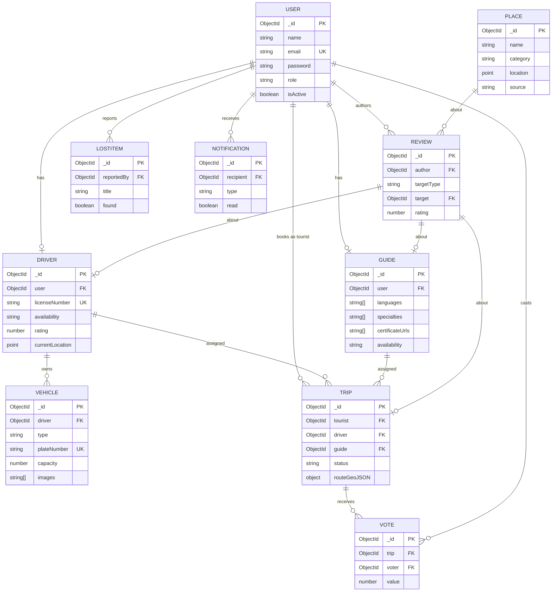

# Entity Relationship Diagram (ERD) — TourMate MongoDB Schemas

10 collections. Relationships are references (ObjectId) rather than embedded joins.

```mermaid
erDiagram
    USER ||--o| DRIVER : "has"
    USER ||--o| GUIDE : "has"
    DRIVER ||--o{ VEHICLE : "owns"
    USER ||--o{ TRIP : "books as tourist"
    DRIVER ||--o{ TRIP : "assigned"
    GUIDE ||--o{ TRIP : "assigned"
    TRIP ||--o{ VOTE : "receives"
    USER ||--o{ VOTE : "casts"
    USER ||--o{ REVIEW : "authors"
    REVIEW ||--o| TRIP : "about"
    REVIEW ||--o| DRIVER : "about"
    REVIEW ||--o| GUIDE : "about"
    USER ||--o{ LOSTITEM : "reports"
    USER ||--o{ NOTIFICATION : "receives"
    PLACE ||--o{ REVIEW : "about"

    USER {
        ObjectId _id PK
        string name
        string email UK
        string password
        string role
        boolean isActive
    }
    DRIVER {
        ObjectId _id PK
        ObjectId user FK
        string licenseNumber UK
        string availability
        number rating
        point currentLocation
    }
    GUIDE {
        ObjectId _id PK
        ObjectId user FK
        string[] languages
        string[] specialties
        string[] certificateUrls
        string availability
    }
    VEHICLE {
        ObjectId _id PK
        ObjectId driver FK
        string type
        string plateNumber UK
        number capacity
        string[] images
    }
    PLACE {
        ObjectId _id PK
        string name
        string category
        point location
        string source
    }
    TRIP {
        ObjectId _id PK
        ObjectId tourist FK
        ObjectId driver FK
        ObjectId guide FK
        string status
        object routeGeoJSON
    }
    VOTE {
        ObjectId _id PK
        ObjectId trip FK
        ObjectId voter FK
        number value
    }
    REVIEW {
        ObjectId _id PK
        ObjectId author FK
        string targetType
        ObjectId target FK
        number rating
    }
    LOSTITEM {
        ObjectId _id PK
        ObjectId reportedBy FK
        string title
        boolean found
    }
    NOTIFICATION {
        ObjectId _id PK
        ObjectId recipient FK
        string type
        boolean read
    }
```
