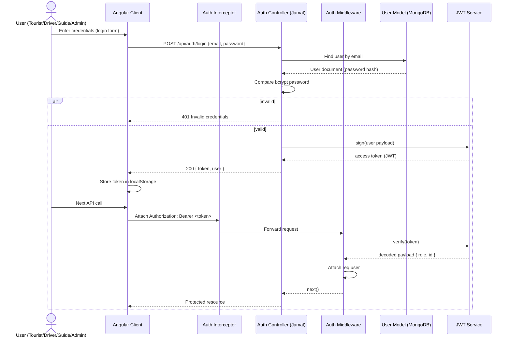

# Sequence Diagram — User Authentication

```mermaid
sequenceDiagram
    actor U as User (Tourist/Driver/Guide/Admin)
    participant C as Angular Client
    participant I as Auth Interceptor
    participant A as Auth Controller (Jamal)
    participant MW as Auth Middleware
    participant UU as User Model (MongoDB)
    participant TK as JWT Service

    U->>C: Enter credentials (login form)
    C->>A: POST /api/auth/login {email, password}
    A->>UU: Find user by email
    UU-->>A: User document (password hash)
    A->>A: Compare bcrypt password
    alt invalid
        A-->>C: 401 Invalid credentials
    else valid
        A->>TK: sign(user payload)
        TK-->>A: access token (JWT)
        A-->>C: 200 { token, user }
        C->>C: Store token in localStorage
        U->>C: Next API call
        C->>I: Attach Authorization: Bearer <token>
        I->>MW: Forward request
        MW->>TK: verify(token)
        TK-->>MW: decoded payload { role, id }
        MW->>MW: Attach req.user
        MW-->>A: next()
        A-->>C: Protected resource
    end
```
