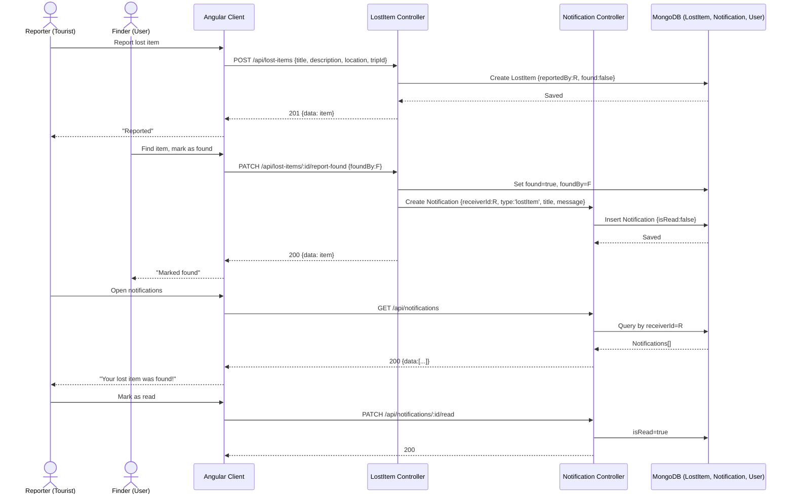

# Sequence Diagram — Lost & Found

A user reports a lost item; when another user reports it found, the reporter is notified. Mirrors `lost_item.routes.js` and `notification.routes.js`.

```mermaid
sequenceDiagram
    actor R as Reporter (Tourist)
    actor F as Finder (User)
    participant C as Angular Client
    participant LI as LostItem Controller
    participant N as Notification Controller
    participant DB as MongoDB (LostItem, Notification, User)

    R->>C: Report lost item
    C->>LI: POST /api/lost-items {title, description, location, tripId}
    LI->>DB: Create LostItem {reportedBy:R, found:false}
    DB-->>LI: Saved
    LI-->>C: 201 {data: item}
    C-->>R: "Reported"

    F->>C: Find item, mark as found
    C->>LI: PATCH /api/lost-items/:id/report-found {foundBy:F}
    LI->>DB: Set found=true, foundBy=F
    LI->>N: Create Notification {receiverId:R, type:'lostItem', title, message}
    N->>DB: Insert Notification {isRead:false}
    DB-->>N: Saved
    LI-->>C: 200 {data: item}
    C-->>F: "Marked found"

    R->>C: Open notifications
    C->>N: GET /api/notifications
    N->>DB: Query by receiverId=R
    DB-->>N: Notifications[]
    N-->>C: 200 {data:[...]}
    C-->>R: "Your lost item was found!"
    R->>C: Mark as read
    C->>N: PATCH /api/notifications/:id/read
    N->>DB: isRead=true
    N-->>C: 200
```
