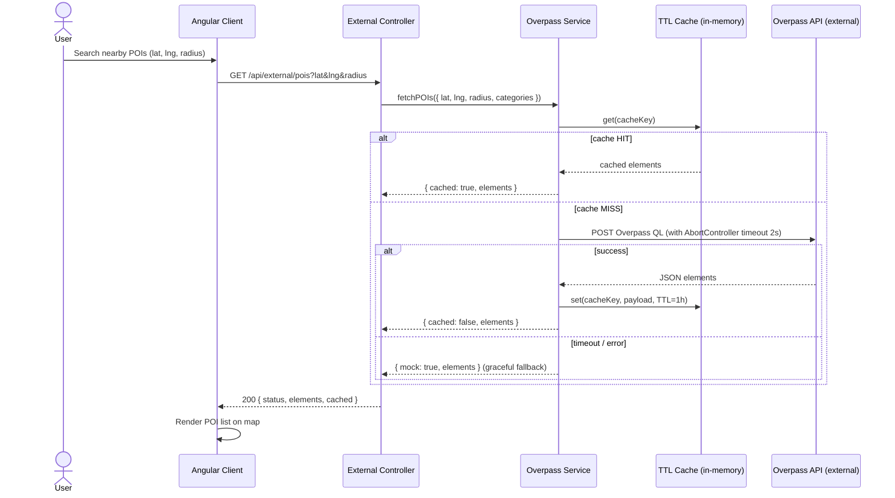

# Sequence Diagram — Overpass API Caching

Goal: keep POI responses under 2s and reduce upstream load via a TTL cache.

```mermaid
sequenceDiagram
    actor U as User
    participant C as Angular Client
    participant EC as External Controller
    participant OS as Overpass Service
    participant CH as TTL Cache (in-memory)
    participant OP as Overpass API (external)

    U->>C: Search nearby POIs (lat, lng, radius)
    C->>EC: GET /api/external/pois?lat&lng&radius
    EC->>OS: fetchPOIs({ lat, lng, radius, categories })
    OS->>CH: get(cacheKey)
    alt cache HIT
        CH-->>OS: cached elements
        OS-->>EC: { cached: true, elements }
    else cache MISS
        OS->>OP: POST Overpass QL (with AbortController timeout 2s)
        alt success
            OP-->>OS: JSON elements
            OS->>CH: set(cacheKey, payload, TTL=1h)
            OS-->>EC: { cached: false, elements }
        else timeout / error
            OS-->>EC: { mock: true, elements } (graceful fallback)
        end
    end
    EC-->>C: 200 { status, elements, cached }
    C->>C: Render POI list on map
```
