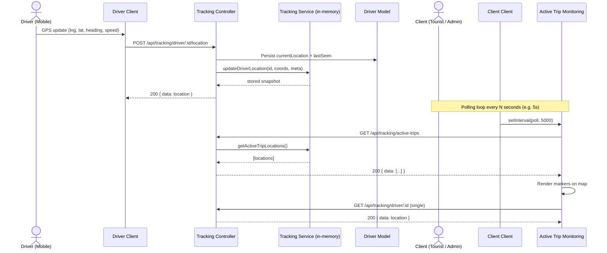

# Sequence Diagram — Polling-Based Location Tracking

Note: Explicitly NO WebSockets. The driver pushes; clients poll on an interval.

```mermaid
sequenceDiagram
    actor D as Driver (Mobile)
    participant DC as Driver Client
    participant PS as Tracking Controller
    participant TS as Tracking Service (in-memory)
    participant DB as Driver Model

    actor C as Client (Tourist / Admin)
    participant CC as Client Client
    participant AC as Active Trip Monitoring

    D->>DC: GPS update (lng, lat, heading, speed)
    DC->>PS: POST /api/tracking/driver/:id/location
    PS->>DB: Persist currentLocation + lastSeen
    PS->>TS: updateDriverLocation(id, coords, meta)
    TS-->>PS: stored snapshot
    PS-->>DC: 200 { data: location }

    Note over C,AC: Polling loop every N seconds (e.g. 5s)
    CC->>AC: setInterval(poll, 5000)
    AC->>PS: GET /api/tracking/active-trips
    PS->>TS: getActiveTripLocations()
    TS-->>PS: [locations]
    PS-->>AC: 200 { data: [...] }
    AC->>AC: Render markers on map
    AC->>PS: GET /api/tracking/driver/:id (single)
    PS-->>AC: 200 { data: location }
```
