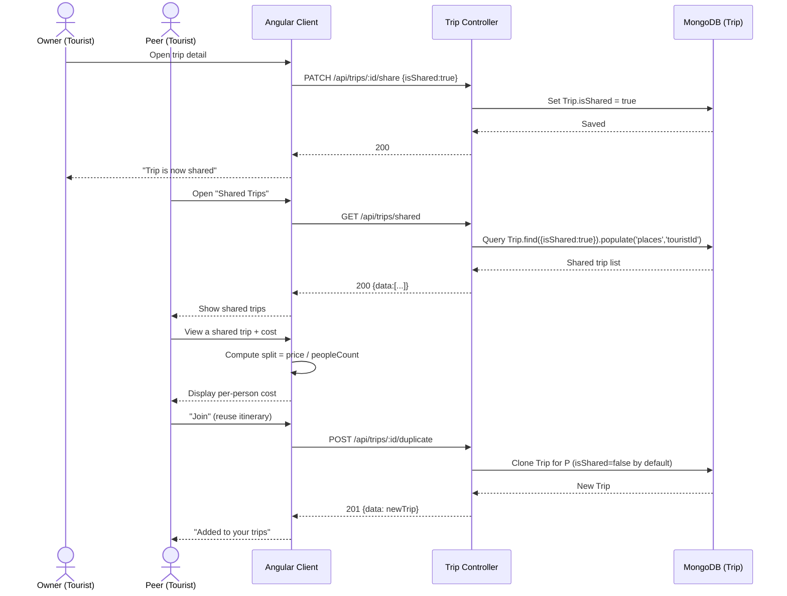

# Sequence Diagram — Shared Trip & Cost Split

A tourist marks a trip as shared; other tourists browse shared trips and can split the estimated cost. The `Trip` model exposes `isShared` and `peopleCount`; cost split is derived as `price / peopleCount`. Mirrors `trip.routes.js` (`shareTrip`, `getSharedTrips`, `duplicateTrip`).

