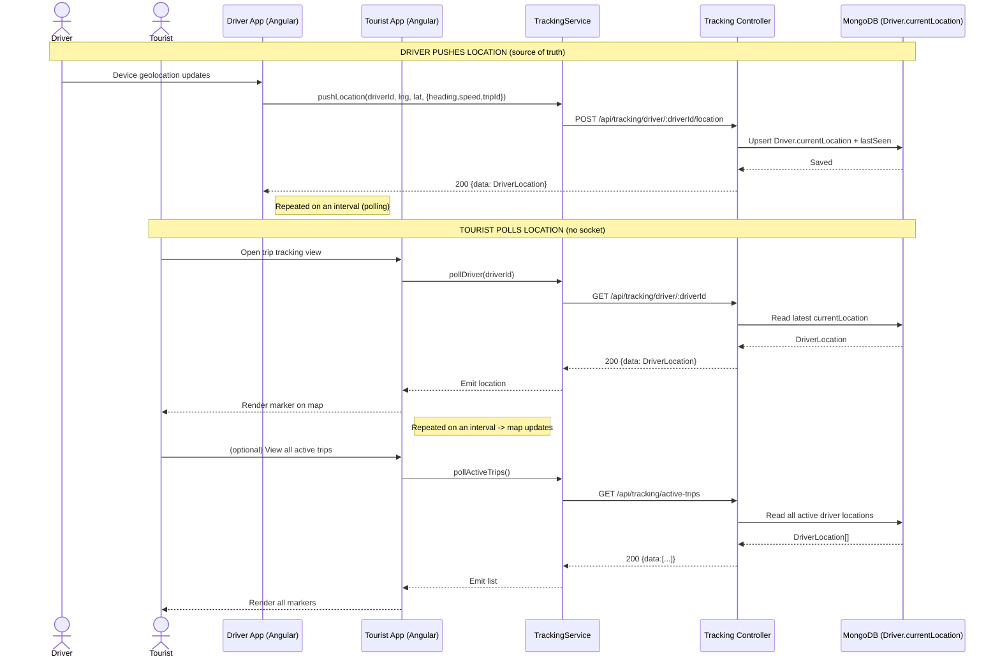

# Sequence Diagram — Location Tracking (Polling)

**Important:** TourMate uses HTTP **polling**, NOT WebSockets. The driver periodically pushes its location; the tourist/admin periodically polls for the latest known position. Mirrors `tracking.routes.js` and `tracking.service.ts`.

