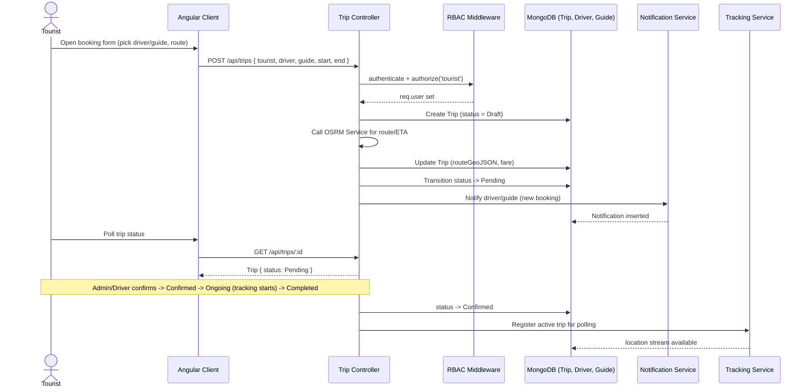

# Sequence Diagram — Trip Booking Flow

```mermaid
sequenceDiagram
    actor T as Tourist
    participant C as Angular Client
    participant TR as Trip Controller
    participant MW as RBAC Middleware
    participant DB as MongoDB (Trip, Driver, Guide)
    participant N as Notification Service
    participant TK as Tracking Service

    T->>C: Open booking form (pick driver/guide, route)
    C->>TR: POST /api/trips { tourist, driver, guide, start, end }
    TR->>MW: authenticate + authorize('tourist')
    MW-->>TR: req.user set
    TR->>DB: Create Trip (status = Draft)
    TR->>TR: Call OSRM Service for route/ETA
    TR->>DB: Update Trip (routeGeoJSON, fare)
    TR->>DB: Transition status -> Pending
    TR->>N: Notify driver/guide (new booking)
    N-->>DB: Notification inserted
    T->>C: Poll trip status
    C->>TR: GET /api/trips/:id
    TR-->>C: Trip { status: Pending }
    Note over T,TR: Admin/Driver confirms -> Confirmed -> Ongoing (tracking starts) -> Completed
    TR->>DB: status -> Confirmed
    TR->>TK: Register active trip for polling
    TK-->>DB: location stream available
```
