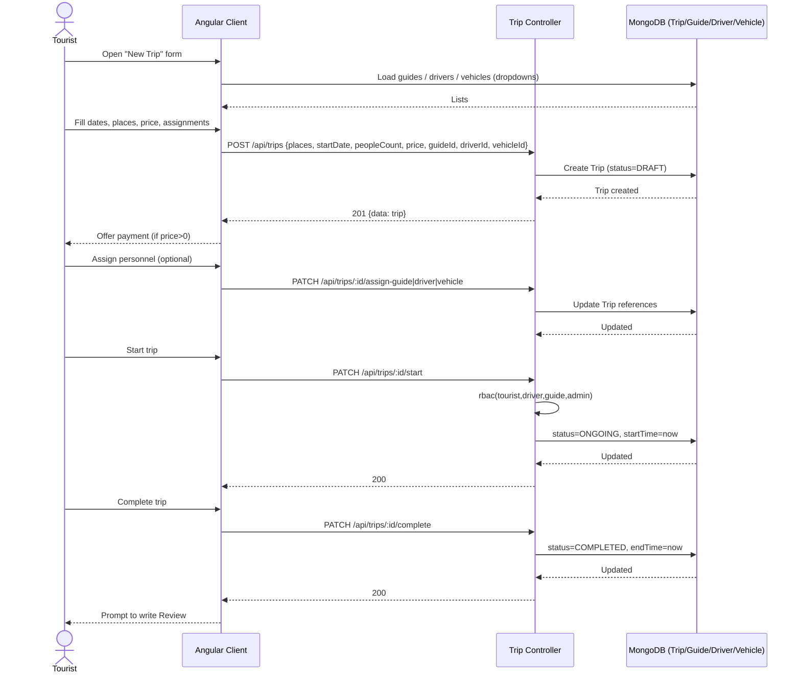

# Sequence Diagram — Trip Lifecycle

Tourist creates a trip, assigns guide/driver/vehicle, then starts and completes it. Mirrors `trip.routes.js`.

```mermaid
sequenceDiagram
    actor T as Tourist
    participant C as Angular Client
    participant TR as Trip Controller
    participant DB as MongoDB (Trip/Guide/Driver/Vehicle)

    T->>C: Open "New Trip" form
    C->>DB: Load guides / drivers / vehicles (dropdowns)
    DB-->>C: Lists
    T->>C: Fill dates, places, price, assignments
    C->>TR: POST /api/trips {places, startDate, peopleCount, price, guideId, driverId, vehicleId}
    TR->>DB: Create Trip (status=DRAFT)
    DB-->>TR: Trip created
    TR-->>C: 201 {data: trip}
    C-->>T: Offer payment (if price>0)

    T->>C: Assign personnel (optional)
    C->>TR: PATCH /api/trips/:id/assign-guide|driver|vehicle
    TR->>DB: Update Trip references
    DB-->>TR: Updated

    T->>C: Start trip
    C->>TR: PATCH /api/trips/:id/start
    TR->>TR: rbac(tourist,driver,guide,admin)
    TR->>DB: status=ONGOING, startTime=now
    DB-->>TR: Updated
    TR-->>C: 200

    T->>C: Complete trip
    C->>TR: PATCH /api/trips/:id/complete
    TR->>DB: status=COMPLETED, endTime=now
    DB-->>TR: Updated
    TR-->>C: 200
    C-->>T: Prompt to write Review
```
