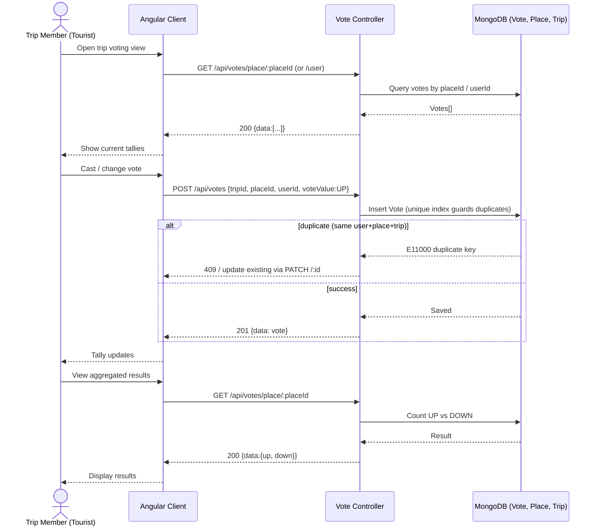

# Sequence Diagram — Voting on a Place

Trip members create votes (UP/DOWN) on candidate places; results are aggregated. Mirrors `vote.routes.js`. The unique index `{tripId, placeId, userId}` enforces one vote per user per place.

