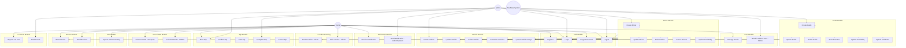

# Use Case Diagram — TourMate

```mermaid
graph TD
    %% Actors
    Tourist((Tourist))
    Driver((Driver))
    Guide((Guide))
    Admin((Admin))
    System((TourMate System))

    %% Modules
    subgraph Auth[Auth Module]
        UC1[Register]
        UC2[Login]
        UC3[Forgot Password]
        UC4[Logout]
    end

    subgraph User[User Module]
        UC5[Manage Profile]
        UC6[Block / Unblock User - Admin]
    end

    subgraph Guide[Guide Module]
        UC7[Create Guide]
        UC8[Update Guide]
        UC9[Delete Guide]
        UC10[Search Guides]
        UC11[Update Availability]
        UC12[Upload Certificate]
    end

    subgraph Driver[Driver Module]
        UC13[Create Driver]
        UC14[Update Driver]
        UC15[Delete Driver]
        UC16[Search Drivers]
        UC17[Update Availability]
    end

    subgraph Vehicle[Vehicle Module]
        UC18[Create Vehicle]
        UC19[Update Vehicle]
        UC20[Delete Vehicle]
        UC21[Get Driver Vehicles]
        UC22[Upload Vehicle Image]
    end

    subgraph Trip[Trip Module]
        UC23[Book Trip]
        UC24[Confirm Trip]
        UC25[Start Trip]
        UC26[Complete Trip]
        UC27[Cancel Trip]
    end

    subgraph Tracking[Location Tracking]
        UC28[Push Location - Driver]
        UC29[Poll Location - Clients]
    end

    subgraph Place[Place / POI Module]
        UC30[Discover POIs - Overpass]
        UC31[Calculate Route - OSRM]
    end

    subgraph Vote[Vote Module]
        UC32[Upvote / Downvote Trip]
    end

    subgraph Review[Review Module]
        UC33[Write Review]
        UC34[Read Reviews]
    end

    subgraph Notification[Notification Module]
        UC35[Receive Notification]
        UC36[Send Notification - Admin/System]
    end

    subgraph LostItem[Lost Item Module]
        UC37[Report Lost Item]
        UC38[Mark Found]
    end

    %% Associations
    Tourist --> UC1 & UC2 & UC3 & UC4 & UC5 & UC23 & UC29 & UC30 & UC31 & UC32 & UC33 & UC34 & UC35 & UC37
    Driver --> UC2 & UC4 & UC13 & UC14 & UC15 & UC17 & UC18 & UC19 & UC20 & UC21 & UC22 & UC28 & UC33
    Guide --> UC2 & UC4 & UC7 & UC8 & UC9 & UC10 & UC11 & UC12 & UC33
    Admin --> UC2 & UC4 & UC6 & UC7 & UC13 & UC18 & UC23 & UC36 & UC38 & UC26
```
